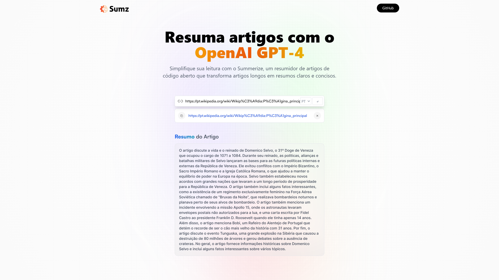

# Sumarizador de Artigos

Resumidor de Artigos com OpenAi GPT-4.
Simplifique sua leitura com o Summerize, um resumidor de artigos de código aberto que transforma artigos longos em resumos claros e concisos.

## Overview

Os usuários devem ser capazes de:

- Buscar por url um artigo e resumir.
- Escolher o idioma de resposta.
- Ver o histórico de buscas.
- Excluir Buscas do histórico
- Copiar qualquer url já buscada.

### Screenshots

 - Desktop

## Tecnologias

### Feito com

- React 18
- Redux toolkit
- Tailwind CSS
- Vite
- Article Extractor and Summarizer (RapidAPI)

## Autor

- GitHub - [Philipe Mello](https://github.com/Philipessj1)
- Link do App - [Sumarizador de Artigos](https://summerizer-ai.vercel.app/)
